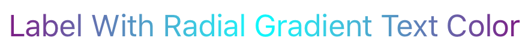

# JNGradientLabel

[](https://app.codacy.com/app/SomeRandomiOSDev/JNGradientLabel?utm_source=github.com&utm_medium=referral&utm_content=SomeRandomiOSDev/JNGradientLabel&utm_campaign=Badge_Grade_Dashboard)
[](https://cocoapods.org/pods/JNGradientLabel)
[](https://cocoapods.org/pods/JNGradientLabel) 
[](https://github.com/Carthage/Carthage) 
[](https://cocoapods.org/pods/JNGradientLabel)
[](https://codecov.io/gh/SomeRandomiOSDev/JNGradientLabel)


An [UILabel](https://developer.apple.com/documentation/uikit/uilabel) subclass that uses gradients as its text or background color.

## Installation

**JNGradientLabel** is available through [CocoaPods](https://cocoapods.org), [Carthage](https://github.com/Carthage/Carthage) and the [Swift Package Manager](https://swift.org/package-manager/). 

To install via CocoaPods, simply add the following line to your Podfile:

```ruby
pod 'JNGradientLabel'
```

To install via Carthage, simply add the following line to your Cartfile:

```ruby
github "SomeRandomiOSDev/JNGradientLabel"
```

To install via the Swift Package Manager add the following line to your `Package.swift` file's `dependencies`:

```swift
.package(url: "https://github.com/SomeRandomiOSDev/JNGradientLabel.git", from: "1.0.0")
```

## Usage

First import JNGradientLabel at the top of your source file:

Swift:

```swift
import JNGradientLabel
```

Objective-C:

```objc
@import JNGradientLabel;
```

After initializing the label (from a Storyboard/XIB or manually) call one of following methods:

Swift: 

```swift
// To produce an `Axial` (Linear) gradient
label.setAxialGradientParameters(startPoint: startPoint,
                                   endPoint: endPoint,
                                     colors: gradientColors,
                                  locations: gradientlocations,
                                    options: ... /* Optional CGGradientDrawingOptions parameter */)
```

OR

```swift
// To produce a `Radial` gradient
label.setRadialGradientParameters(startCenter: startCenter,
                                  startRadius: startRadius,
                                    endCenter: endCenter,
                                    endRadius: endRadius,
                                       colors: gradientColors,
                                    locations: gradientlocations,
                             radiiScalingRule: ... /* Optional RadialGradientRadiiScalingRule parameter */,
                                      options: ... /* Optional CGGradientDrawingOptions parameter */)
```

Objective-C:

```objc
// To produce an `Axial` (Linear) gradient
[label setAxialGradientParametersWithStartPoint:startPoint 
                                       endPoint:endPoint 
                                         colors:gradientColors 
                                      locations:gradientLocations
                                        options:gradientDrawingOptions];
```

OR

```objc
// To produce a `Radial` gradient
[label setRadialGradientParametersWithStartCenter:startCenter 
                                      startRadius:startRadius 
                                        endCenter:endCenter 
                                        endRadius:endRadius 
                                           colors:gradientColors 
                                        locations:gradientLocations 
                                 radiiScalingRule:radiiScalingRule 
                                          options:gradientDrawingOptions];
```

And thats it!

By default, the label draws the gradient as the color of the text. The label also supports drawing the gradient as the background of the text. To do this, simply set the `textGradientLocation` property as follows:

Swift: 

```swift
label.textGradientLocation = .background
```

Objective-C:

```objc
label.textGradientLocation = TextGradientLocationBackground;
```

OR 

```objc
[label setTextGradientLocation:TextGradientLocationBackground];
```

Screenshots
--------

Foreground Axial Gradient:


Foreground Radial Gradient:


Background Axial Gradient:


Background Radial Gradient:


## Contributing

If you have need for a specific feature or you encounter a bug, please open an issue. If you extend the functionality of **JNGradientLabel** yourself or you feel like fixing a bug yourself, please submit a pull request.

## Author

Joe Newton, somerandomiosdev@gmail.com

## License

**JNGradientLabel** is available under the MIT license. See the `LICENSE` file for more info.
